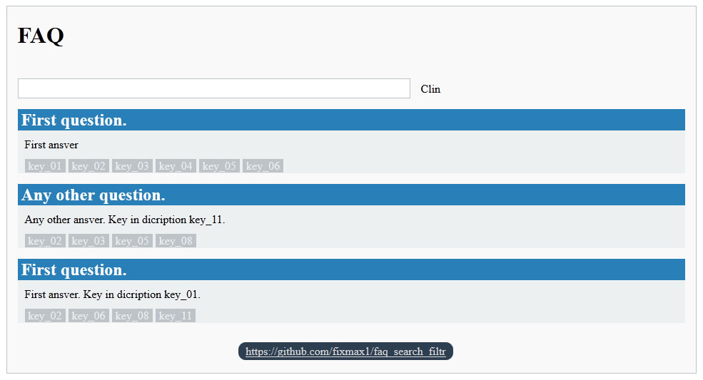
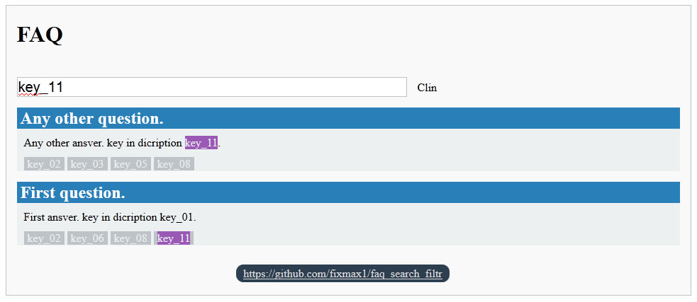

<h1>FAQ search filtr</h1>
<h2>Описание</h2>
Удобная страница FAQ-а. Позволяет искать по странице (Заголовок, Описание, Ключевые слова), при этом вопросы, в которых не встречается искомая фраза скрываются.
Для более удобного поиска добавлены ключи, поиск происходит и по ключам. При нажатии на ключ фильтрация происходит по нему.

